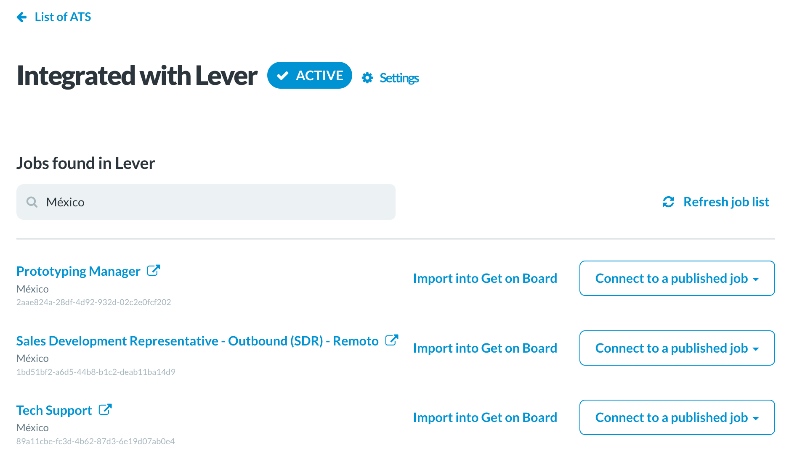

# useFilterCollection hook

## Use case

Search or reduce a list of anything by matching a text. Check the screenshot; it reduces the list of jobs to those including the text México.

```javascript
import React from 'react';

import useFilterCollection from '../useFilterCollection';
import useDebounce from '../useDebounce';

...

const Postings = ({ systemId }) => {
  // Input text to filter jobs
  const [filterText, setFilterText] = useState('');

  // Debounce on filterText after 500 ms
  const searchTerm = useDebounce(filterText, 500);

  ...

// Filter the collection when searchTerm changes
  const filteredPostings = useFilterCollection(
    state.postings, // the collection
    searchTerm, // filter terms (is a text)
    posting => `${posting.title} ${posting.location}` // predicate
  );
  ...
}
```


