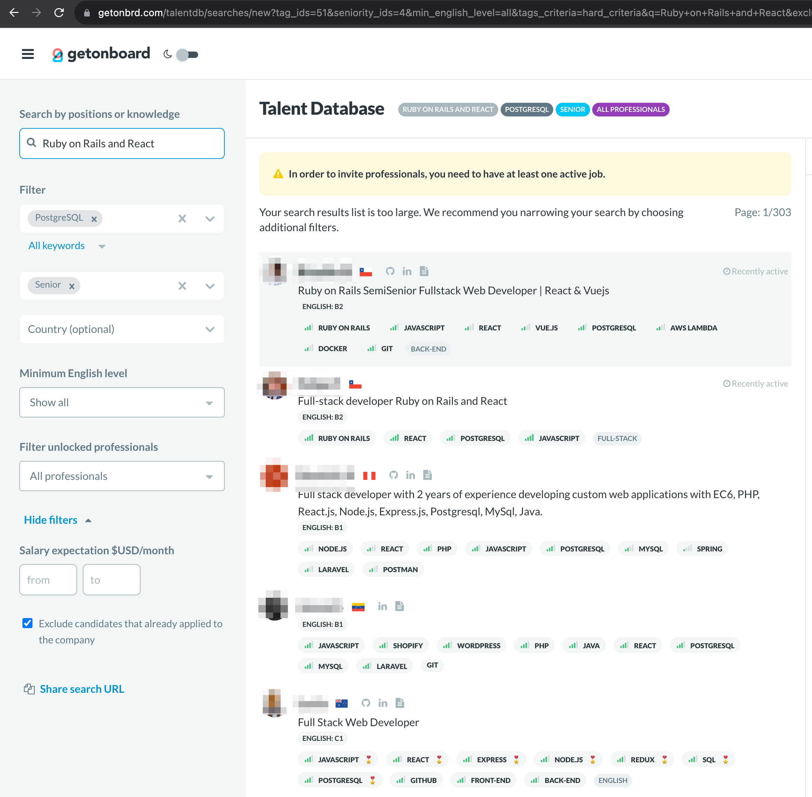

# useFilterCollection hook

## Use case

Keep the search params at the URL synchronized with a state object usually transformed within a reducer. In the use case below the URL responds to changes in the search form (state) and viceversa, **allowing to share the URL** with other users.

```javascript
import React from 'react';
import {
  useSearchParams,
  mapSearchParamsToObject,
} from './useSearchParams';

import { defaultFilterValues } from './reducers';

...

const SearchForm = ({ searchId, state, dispatch }) => {
  const [searchParams, setSearchParams] = useSearchParams();

  ...

  // Resolve the search when it is the first time loading the form
  // and only whether there are enough criteria to search also initializing
  // the filter values
  useEffect(() => {
    if (state.status === 'initial' && isFirstLoadRef.current) {
      isFirstLoadRef.current = false;

      const searchParamsObject = mapSearchParamsToObject(
        searchParams,
        state.filterValues,
        defaultFilterValues
      );

      dispatch({ type: 'INITIALIZE_FILTER_VALUES', data: searchParamsObject });
      dispatch({ type: 'SEARCH' });
    }
  }, [searchParams, state.filterValues, state.status, dispatch]);

  ...

  return (
    <>
      <form
        onSubmit={event => {
          event.preventDefault();
          // Change URL search params and dispatch a search
          setSearchParams(
            { ...state.filterValues, page: '1' },
            { clearHash: true }
          );
          dispatch({ type: 'SEARCH' });
        }}
        className="px1 pt-1"
      >
      ...
      </form>
      ...
    </>
  )
```


